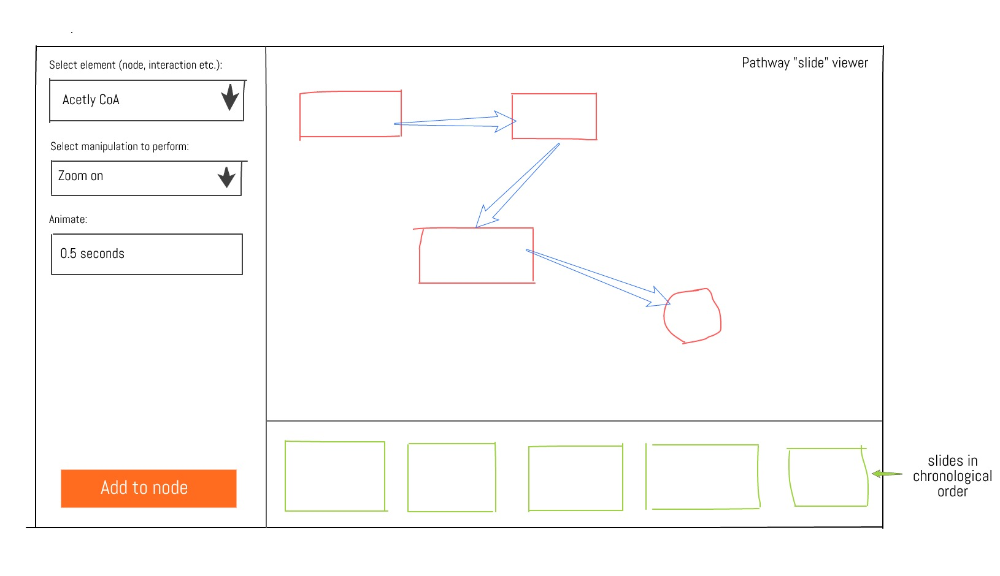

# GSoC Proposal: Pathway Presenter
# Aim
Enable researchers to easily create presentations from pathways in WikiPathways.

**N.B.:** Please note this is a draft! This is a splurge of my ideas (with no references).

## Background
## Limitations of WikiPathway's Diagrams
WikiPathways goes a significant way to improving the accesibility of pathway information through interactive diagrams rendered via PVJS. However, these diagrams are not often used outside of WikiPathways itself. For example, researchers still mostly use static images of pathway diagrams during presentations and Nature Highlights even uses static images in their online resources. 

## Story-based Pathways
Anyone who has experienced enough lectures and presentations knows that static text, statistics and complicated diagrams are a sure way to lose the attention of the audience. [Studies show](https://prezi.com/the-science/) that symbols, quality visual aids, stories, and minimal text improve the understandability of a given presentation. So, why are pathway diagrams still so dense? Why are they often accompanied with large figure captions to describe them? A diagram should explain itself, it shouldn't need to be explained.

One method to improve a pathway diagrams understandability, is to include a temporal dimension. Static pathway diagrams are often offputting to readers since they appear cluttered with too much information, the reader doesn't know where to start. Hence, a pathway can be explained as a story, showing only the information needed for one part at one time. Showing and hiding nodes, zooming in on them, and highlighting interactions at distinct times shows the reader how the pathway behaves in a succinct manner. This is the same concept as slides in a presentation. A presenter doesn't show all of the information in their presentation in one image and talk through that, the image changes as they move through their presentation. 

### Kaavio/PVJS Manipulation API
I have already created a Kaavio/PVJS "Manipulation API" that allows for developers to highlight, zoom to, or pan to nodes on a PVJS-rendered pathway. This API will be used extensively in this project.

## Methods
### Presentation API
A new JavaScript API will be created that utilises the Manipulation API to create presentations containing different slides. The API will contain methods that allow for developers to create presentations, sides and add manipulation API operations to nodes in a slide. Each new "slide" represents a pathway "state". Each state contains specification for which manipulation API methods are called on entering that state. 

For example:
- Slide 1:
  - Hides all elements in pathway except for `node_1` and `node_2`, and highlights these nodes
- Slide 2:
  - Un-highlights `node-1` and `node_2`.
  - Animates in `node_3` `node_4` and `node_5`
  - Zooms in to those three nodes.
  
### User Interface
An interface will be created that enables users to easily create presentations. The interface relies on the presentation API. 

 
### Data Strorage
All data is stored as a JSON object in a similiar way to the [Google Slides API](https://developers.google.com/slides/reference/rest/v1/presentations#Presentation). The presentation object contains attributes such as a Title, Description and an orderered list of the Slide Objects. The slide object contains key: value pair node IDs with an ordered list of the manipulation API operations, and their parameters, that should be carried out. 

Example Presentation:
```javascript
{
  id: string,
  wpId: string,
  title: string,
  description: string,
  slides: [
    {
      object(Slide)
    }, ...
  ]
}
```

Example Slide:

Note that each manipulation API operation will be carried out in order, with no delays or user input to start animations. I propose to not implement features such as delays, in favour of using new slides. There is no ability for the user to click "next" to start the next manipulation API operation within a slide, new slides should be created for such behaviour.

```javascript
{
  animateIn: true,
  animateOut: false,
   node_1: [
    {
      hidden: false,
      animate: 50
    },
    {
      zoomIn: true,
      animate: 100
    }
  ],
  node_2: [
    {
      highlight: true,
      color: 'red',
    }
  ]
}
```

## Future Work
This project represents a starting point for future work that will improve upon this work. For example, a further feature would be the easy embedding of these presentations in other web applications. Hence this would allow for sites like Nature Reviews to replace their static diagrams with these story based pathways. Furthermore, the export of an MP4 version of these pathway presentations would allow for easy embedding within powerpoint presentations and the like. I have taken design considerations to make it easily possible to create an open API for third-party developers to create pathway presentations through their own applications. 
  
## Benefits to WikiPathways and Biomedical Communities
Interactive pathway presentations is a further step forward in improving the dissemination of pathway knowledge. Currently, researchers mostly use static pathway diagrams in their presentations, in text books and even online. The proposed work here, will hopefully be a starting point to creating a service that is not only used within WikiPathways but also in other domains. One can foresee the use of this "Pathway Presenter" in spoken presentations, Nature highlights, and in teaching material.
